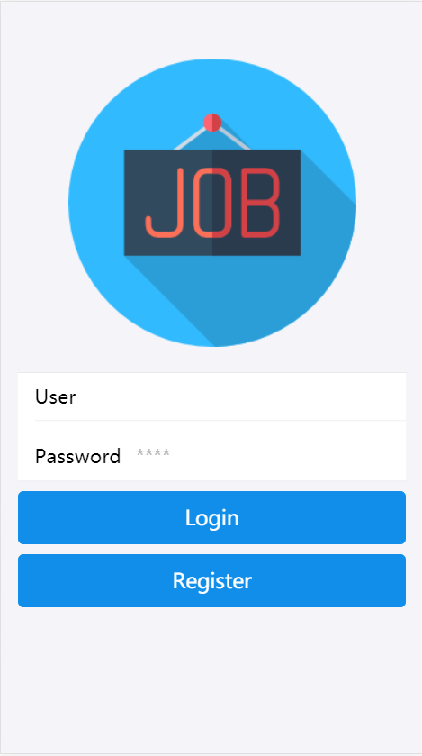
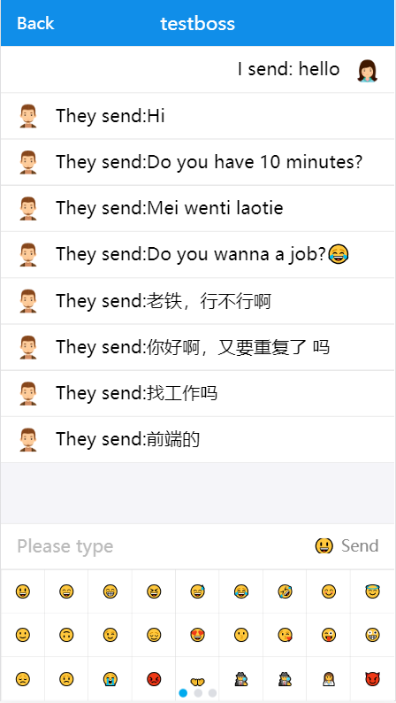
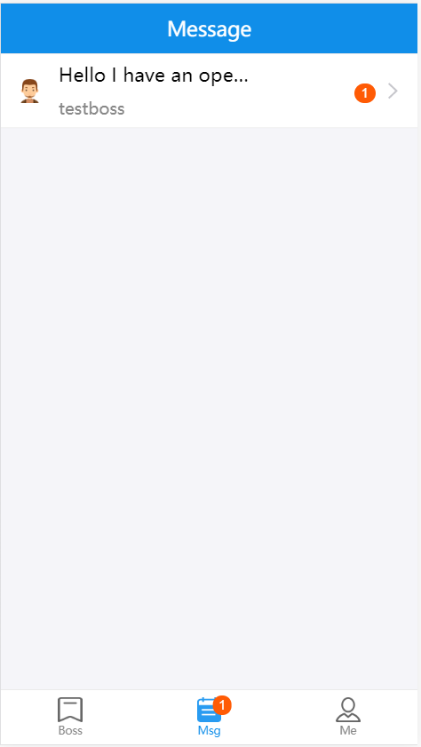
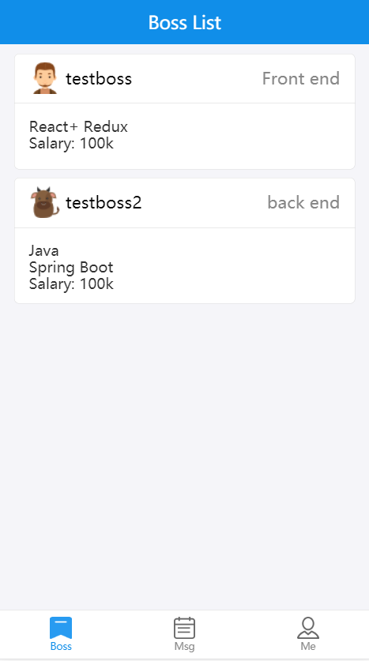

# Hiring Light

A light-weight hiring mobile app with live chat

## Demo






## Getting Started

These instructions will get you a copy of the project up and running on your local machine for development and testing purposes.

### Prerequisites

This project use Express.js, mongoDB.  
So make sure you have these installed on you machine.  
node version >= 8.0  
mongoDB version 4.0.6

### Installing

A step by step series of examples that tell you how to get a development env running.

```javascript
//using npm to install dependencies
npm install
//start the dev backend server
cd server
nodemon server.js
//start the front end part in the project root
npm run start
```

you should be good to go!  
Notes: The front end part run on localhost:3000 and server side user localhost:9093. Ensure they are not occupied;

## Running the tests

To be done

## Works to be done

- [ ] Replace the naive login authentication with JWT
- [ ] Refactor the initial code for better performance
- [ ] Add SSR for better loading experience
- [ ] Adding Unit Test for Components and Server-side code

## Built With

- [Express](https://expressjs.com/) - Fast, unopinionated, minimalist web framework for Node.js
- [React](https://reactjs.org/) - A JavaScript library for building user interfaces
- [MongoDB](https://www.mongodb.com/) - Open source no relational database
- [Ant-Design](https://mobile.ant.design/) -A UI component library based on Preact / React / React Native

## Contributing

To be done

## Authors

- **Osito Wang** - _Initial work_ - [OsitoWang](https://github.com/ositowang)

## License

This project is licensed under the MIT License - see the [LICENSE.md](LICENSE.md) file for details
